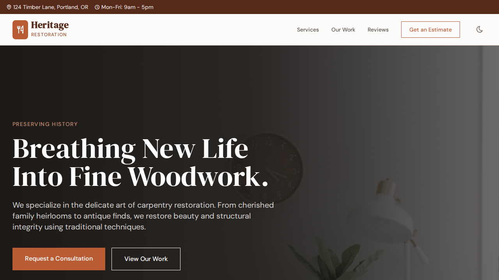

# Heritage Carpentry Restoration

> Breathing new life into fine woodwork.



## Features

- ✅ Fully responsive (mobile, tablet, desktop)
- ✅ Dark mode toggle
- ✅ Alpine.js interactivity (forms, modals, carousels, accordion FAQ)
- ✅ Contact form with client-side validation
- ✅ Accessible — ARIA labels, keyboard navigation, semantic HTML5
- ✅ SEO-ready — meta tags, Open Graph, semantic structure
- ✅ Elegant Terracotta + Cream color palette and DM Serif typography

## Use Cases

- Furniture Restoration Services
- Antique Shops
- Fine Woodworking Professionals
- Carpentry Studios

## Technologies Used

| Technology | Purpose |
|------------|---------|
| [Tailwind CSS](https://tailwindcss.com/) | Utility-first CSS framework |
| [Alpine.js](https://alpinejs.dev/) | Lightweight JS interactivity |
| [Tabler Icons](https://tabler-icons.io/) | Consistent icon library |
| [Google Fonts](https://fonts.google.com/) | Typography |

## Getting Started

No build step required. Open `index.html` in any modern browser.

```bash
# Optional: serve with a local server
npx serve .
```

## Customization

- **Colors**: Edit the `tailwind.config` block in `index.html` to change brand colors.
- **Fonts**: Replace the Google Fonts URL in `<head>` with your preferred fonts.
- **Content**: Update text, images, and links directly in `index.html`.
- **Sections**: Add or remove `<section>` blocks as needed.

## License

MIT License — see [LICENSE](LICENSE) for details.

## Author

**Abel Gallo Ruiz**

---

*Template generated for the [Templates Store](../../README.md).*