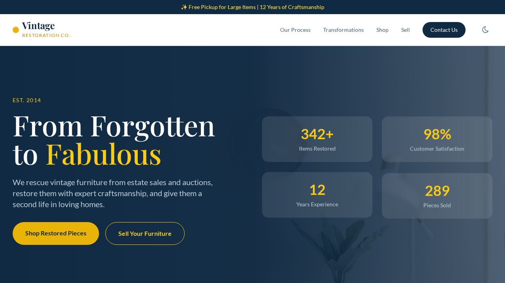

# Vintage Furniture Restoration

> From Forgotten to Fabulous — Bringing vintage furniture back to life.



## Features

- ✅ **Interactive Before/After Slider** — Drag to reveal transformations (MAIN FEATURE)
- ✅ **Animated Timeline Process** — Vertical 4-step process with scroll-triggered animations
- ✅ **Counter Animation** — Animated stats (items restored, satisfaction rate, years in business)
- ✅ **Inventory Filter System** — Filter by category (All, Chairs, Tables, Storage)
- ✅ **Sell Your Furniture Form** — Comprehensive submission form with photo upload preview
- ✅ **Fully responsive** (mobile, tablet, desktop)
- ✅ **Dark mode toggle**
- ✅ **Alpine.js interactivity** (forms, modals, carousels, accordions)
- ✅ **Contact form with client-side validation**
- ✅ **Accessible** — ARIA labels, keyboard navigation, semantic HTML5
- ✅ **SEO-ready** — meta tags, Open Graph, semantic structure
- ✅ **Navy + Gold color palette** with Playfair Display typography

## Use Cases

- Furniture Restoration Businesses
- Antique Dealers & Vintage Shops
- Estate Sale Companies
- Custom Furniture Makers
- Interior Design Studios

## Technologies Used

| Technology | Purpose |
|------------|---------|
| [Tailwind CSS](https://tailwindcss.com/) | Utility-first CSS framework |
| [Alpine.js](https://alpinejs.dev/) | Lightweight JS interactivity |
| [Tabler Icons](https://tabler-icons.io/) | Consistent icon library |
| [Google Fonts](https://fonts.google.com/) | Typography (Playfair Display + Lato) |

## Getting Started

No build step required. Open `index.html` in any modern browser.

```bash
# Optional: serve with a local server
npx serve .
```

## Customization

- **Colors**: Edit the `tailwind.config` block in `index.html` to change the Navy + Gold palette.
- **Fonts**: Replace the Google Fonts URL in `<head>` with your preferred fonts.
- **Content**: Update text, images, and links directly in `index.html`.
- **Sections**: Add or remove `<section>` blocks as needed.
- **Before/After Images**: Replace the image URLs in the slider sections with your own transformations.

## Animations Included

1. **Before/After Slider** — Mouse/touch interactive reveal
2. **Timeline Line Growth** — Animated vertical line connecting process steps
3. **Counter Animation** — Numbers count up from 0 on scroll
4. **Floating Cards** — Stats cards with gentle floating animation
5. **Step Reveal** — Process steps slide in on scroll
6. **Testimonial Carousel** — Auto-rotating with fade transitions

## License

MIT License — see [LICENSE](LICENSE) for details.

## Author

**Abel Gallo Ruiz**

---

*Template generated for the [Templates Store](../../README.md).*